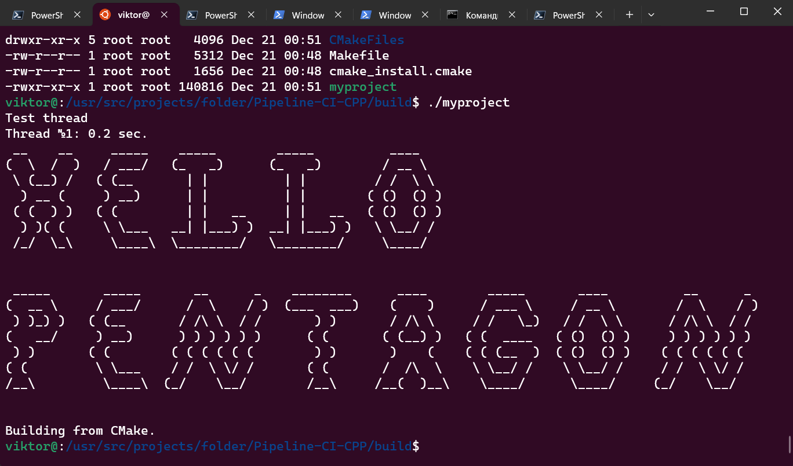

## Пример простого развертывания приложения на C++

### Сборка из под Linux (Ubuntu 22.04.3 LTS)

_Создать новую папку, чтобы снести потом_
~~~bash
sudo mkdir new_folder && cd new_folder/
~~~

_Склонировать репозиторий_
~~~bash
sudo git clone https://github.com/Vik154/Pipeline-CI-CPP.git
~~~

_Перейти в репозиторий, создать папку "build" и перейти в неё_
~~~bash
cd Pipeline-CI-CPP/ && sudo mkdir build && cd build/
~~~

_Внутри папки "build" сконфигурировать файлы с помощью CMake_
~~~bash
sudo cmake ..
~~~

_Всё также внутри папки "build" собрать проект_
~~~bash
sudo cmake --build .
~~~

_Запустить_
~~~bash
./myproject
~~~
